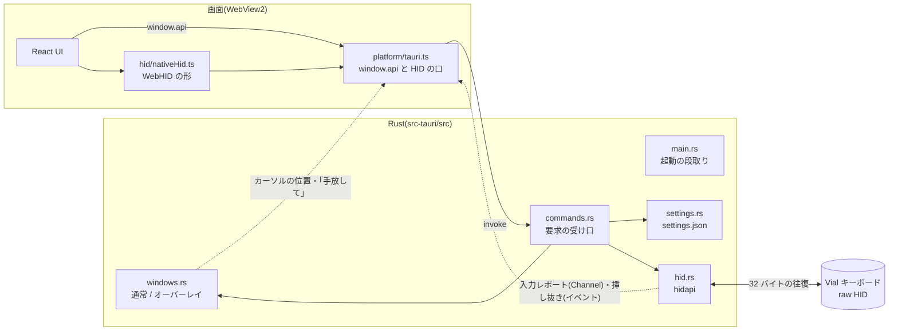
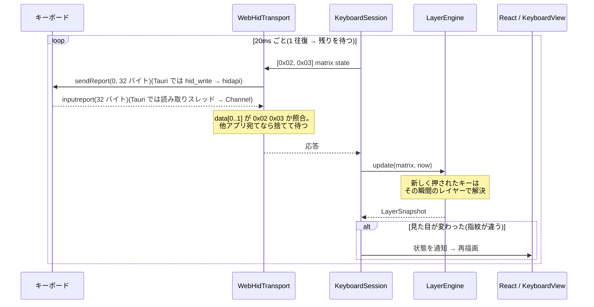
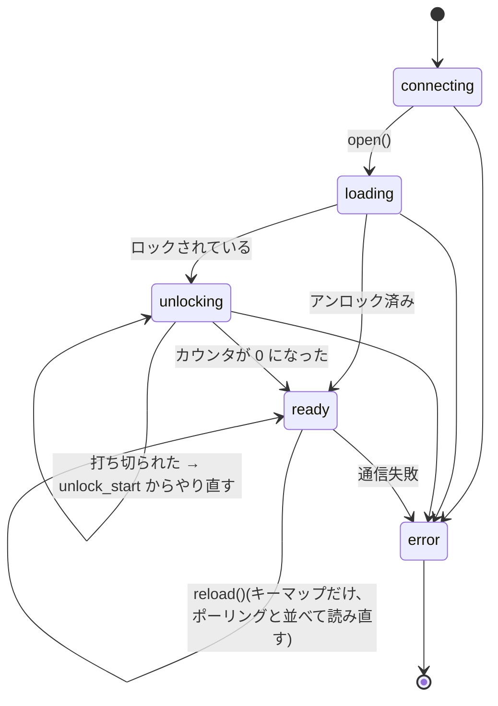

# 設計

Live Keymap Viewer の中身の地図。**何がどこにあり、なぜそうなっているか**を書く。
手順(ビルド・テスト・機能の足し方)は [DEVELOPMENT.md](DEVELOPMENT.md)、
Vial のバイト列の話は [PROTOCOL.md](PROTOCOL.md) にある。

---

## 1. 前提

- **固定データを持たない。** キーマップ・レイヤー数・物理配置・カスタムキーコード名は、
  すべて接続したキーボードから読む。アプリに埋め込んであるのはキーコードの
  「値 → 名前」表と、JIS / US の文字表だけ。
- **対象は Windows。** 開発は WSL(Rust はコンテナ)で行うが、WSL からは USB が見えないので実機では動かない
  ([DEVELOPMENT.md §3](DEVELOPMENT.md#3-wsl-で開発するときの注意))。
- **アプリは Tauri 2。** 外側(ウィンドウ・HID・設定・ログ)は Rust、画面は React を Windows の
  WebView2 で描く。2026-09-24 に Electron から移した(配布物が 369MB → exe 1 つ 6MB。理由は §6)。
- **対応は Vial protocol 6 / VIA protocol 9 のみ。** Cornix LP で確かめている。

## 2. プロセス構成

**HID は Rust の hidapi で扱い、画面からは WebHID と同じ形に見せる。** WebView2 には WebHID の
許可や選択ダイアログを差し込む口が無い(Electron には `select-hid-device` などがあった)。
[hid/nativeHid.ts](../src/renderer/src/hid/nativeHid.ts) が `navigator.hid` と `HIDDevice` のうち
アプリが使うところだけを作るので、接続の管理(`session/`)・候補の確かめ(`deviceProbe.ts`)・
往復(`WebHidTransport`)・プロトコル(`vial.ts`)は、Electron 版のコードのまま動く。
ブラウザで開いたとき(`npm run dev`)は本物の WebHID を使う。

Rust がするのは、Vial のインターフェース(usage page `0xFF60`)を並べる・開く・書く・
届いたレポートを画面へ流す・挿し抜きを知らせる、だけ。直列化・時間切れ・応答の照合は画面の側
(`transport.ts`)の仕事のまま。hidapi は 1 つのハンドルを読むのと書くのに同時には使えないので、
2 回開いて読む用(専用のスレッド)と書く用に分けている。挿し抜きの通知は無いので 2 秒ごとに一覧を
取り直して差を見る(使っていたものが抜けたのは、読み取りの失敗ですぐ分かる)。

画面と Rust の約束は [src/shared/ipc.ts](../src/shared/ipc.ts) の `RendererApi`(部品が使う関数)と、
[src-tauri/src/commands.rs](../src-tauri/src/commands.rs)(Rust のコマンド)。つなぐのは
[platform/tauri.ts](../src/renderer/src/platform/tauri.ts) だけで、部品は Tauri を直接呼ばない。
画面が使わないものは公開しない。

## 3. renderer の層

矢印は「依存する向き」。**下の層は上の層を知らない。** `keycodes` / `layout` / `engine` は
DOM にも HID にも触らない純粋なロジックで、そのぶん単体テストが厚い。

| ディレクトリ | 主なファイル | 役割 |
|---|---|---|
| `keycodes/` | `decode.ts` | 生の u16 を `Keycode`(判別共用体)にする。範囲は PROTOCOL.md §5 |
| | `labels.ts` | `Keycode` → 画面の文字。**JIS 表と US 表**、Shift 面、日本語の補足 |
| | `tapDance.ts` | `TapDanceEntry` と「長押しで出るレイヤー」の規則(engine と描画が共用) |
| | `table.generated.ts` | vial-gui の `keycodes_v6.py` から生成した名前表 |
| `layout/` | `kle.ts` | KLE のパース。vial-gui の `kle_serial.py` と同じ挙動 |
| | `geometry.ts` | KLE → 物理キー / エンコーダー / 外接矩形 |
| | `knobButtons.ts` / `encoderStrip.ts` | ノブの押し込みがどのキーか(分かっているキーボードだけ) / 押し込みが分からないノブを図の下に並べる配置計算と viewBox |
| | `layoutOptions.ts` | VIA のレイアウトオプション(ビット詰め)をほどく |
| `engine/` | `layerState.ts` | `LayerEngine`。押下の列からアクティブなレイヤーを出す(HANDOFF §6) |
| | `symbolRoutes.ts` | 記号ごとの打ち方(どのレイヤーの、どのキーを、Shift 付きか)を手数の少ない順に |
| | `layerSummary.ts` | キーマップから、各レイヤーへの行き方(`Space 長押し` など)と空かどうかを読む |
| `hid/` | `transport.ts` | `Transport` インターフェース、直列化キュー、`WebHidTransport` |
| | `vial.ts` | プロトコルの各コマンドと `loadKeyboard` / `reloadKeymap` |
| | `mockTransport.ts` | ファームと同じバイト並びで答える偽デバイス |
| | `nativeHid.ts` | Tauri 版の HID。Rust の hidapi を `navigator.hid` / `HIDDevice` の形に見せる(§2) |
| | `xz.ts` | 定義 JSON の XZ 展開 |
| | `deviceProbe.ts` | 候補のインターフェースに問い合わせ、答えるものを選ぶ |
| | `definitionCache.ts` | 定義のキャッシュ(localStorage、UID と定義のバイト数で引く) |
| | `keymapCache.ts` | キーマップのキャッシュ(localStorage、UID で引く)。繋いだ直後の即表示に使う |
| `session/` | `keyboardSession.ts` | 1 接続ぶん: 読み込み → アンロック → ポーリング → 読み直し |
| | `keyboardConnection.ts` | 接続を持ち続ける: デバイスの選び方、セッションの差し替え、切れたら繋ぎ直す |
| `hooks/` | `useVialKeyboard.ts` | 接続の状態を React に渡す |
| | `useSettings.ts` | 設定を React に渡す。変えるのは `update(patch)` だけ |
| | `usePreview.ts` | 図のプレビュー(乗せる・固定・記号の案内)と戻す規則。規則は `previewReducer` / `resolvePreview` の純粋な関数 |
| | `useKeymapGuide.ts` | キーマップから読む案内(行き方・記号の打ち方・キーの名前) |
| | `useOverlayFade.ts` | オーバーレイを薄くするか(`overlayFaded`)と、後ろのぼかしの入り切り |
| `components/` | `KeyboardView.tsx` / `KeyCap.tsx` | SVG の描画。プレビュー・Shift の強調・レイヤー名の色帯 |
| | `LayerStrip.tsx` / `PreviewNotice.tsx` | ツールバーのレイヤー一覧(行き方はツールチップ、設定で番号の横にも。空は畳む)。乗せる・押すとプレビュー、ダブルクリックで名前 / プレビュー中の札 |
| | `KeyboardFrame.tsx` / `StatusViews.tsx` | 図の枠(レイヤー色の縁・プレビューの破線) / エラーの帯と未接続の画面 |
| | `SymbolFinder.tsx` | 記号の出し方の一覧。押すと App がそのレイヤーをプレビューし、押すキーを光らせる |
| | `SettingsPanel.tsx` / `ModifierBadges.tsx` | 設定パネル(レイヤー名・オーバーレイ・長押しの判定) / Ctrl・Shift・Alt・Win の印 |
| | `ui/` | 共通の部品(`Button` / `Popover` / `Menu` / アイコン)。ボタンはすべて `Button` を使う |
| | `Toolbar.tsx` / `OverlayControls.tsx` | 通常ウィンドウの操作 / オーバーレイの操作パネルと自動フェード |
| | `LoadingPanel.tsx` / `UnlockPanel.tsx` | 読み込みの進み具合 / アンロックの案内 |
| (直下) | `messages.ts` | 画面に出す文言。部品・接続まわりの案内はここから引く(キーの表示名は `keycodes/labels.ts`) |
| `lib/` | `cn.ts` / `theme.ts` | Tailwind のクラスの組み立て(clsx + tailwind-merge)、JS から使う色トークン |
| `mock/` | `cornix.generated.ts` | モックのデータ(.vil と実機の定義から生成) |
| `platform/` | `tauri.ts` | Tauri で動いているときに `window.api` と HID を用意する。**いちばん先に読み込む**(`main.tsx`) |

## 4. キーを押してから画面が変わるまで

- **matrix state はアンロックしないと読めない**(ファームがキーロガー対策で止めている)。
- 押下の指紋(表示レイヤー + 押されているキー + 長押し確定)が前回と同じなら通知しない。
  20ms ごとに 50 キーの SVG を描き直さずに済む。

## 5. セッションの状態

`KeyboardSession` は 1 接続につき 1 つ作り、切断や再接続で**捨てて作り直す**。
作り直すのは `KeyboardConnection` で、`'idle'`(セッションが無い)と `reconnecting`(切れて繋ぎ直そうと
している)が足される。一度でも unlocking / ready まで進んだ実機のセッションが error になったら、
2 秒ごとに許可済みのデバイスを探し直し、HID の `connect` イベントが来たら待たずに試す。

## 6. 設計の判断と、その理由

| 判断 | 理由 |
|---|---|
| **リクエストは 1 本のキューで直列化する**(`RequestQueue`) | ファームは応答にリクエスト ID を持たない。並走させると取り違える |
| **時間切れで諦めた要求の数を数え、遅れて届いた応答は捨てる**(`WebHidTransport.abandoned`) | ファームは応答に要求 ID を持たないので、諦めた要求への応答が遅れて届くと**投げ直した要求の応答として受け取ってしまい、以後ずっと 1 回ずつずれる**(docs/BLUETOOTH.md §3)。同じコマンドなので照合では弾けない。応答は送った順に返るので、諦めた数だけ捨てれば並びが戻る。応答ごと失われた場合に数え続けないよう、2 秒の窓を過ぎたら数え直す |
| **応答は照合してから受け取る**(`SendOptions.validate`) | raw HID の入力レポートは、その HID を開いている**全プロセス**に配られる。Vial を開いたままだと相手宛ての応答が届く。VIA コマンドは `data[0]` にコマンド ID が残るので、それで見分ける(PROTOCOL.md §2) |
| **候補が複数あれば、答えるものを確かめてから繋ぐ**(`pickResponsiveDevice`) | USB と Bluetooth の両方で繋がっていると、同じ VID/PID の Vial インターフェースが 2 つ見え、出力先でない側は答えない。`[0xFE, 0x00]` はアンロック中でも必ず答えるので、それで確かめ、一番速いものを使う |
| **繋いだら、まずキャッシュで図を出して、裏で読み直して確かめる** | 全部読むには 70〜95 往復かかる(USB で数秒、Bluetooth では 30 秒)。そのあいだ画面には何も出ない ― モードを切り替えるたび、繋ぎ直すたびに、である。キャッシュ(定義 + キーマップ)が揃っていれば、身元を確かめる **3 往復**(VIA の版・Vial の版と UID・定義のバイト数)だけで図を出し、押下のポーリングもすぐ始める。読み直しは裏で走らせ、違っていたらエンジンごと差し替える。要求は 1 本のキューに並ぶので、確かめているあいだは matrix の間隔が延びるだけで、押下の表示は生きたまま |
| **モードを切り替えるときは、古いウィンドウにキーボードを手放させてから新しいものを作る** | 透明ウィンドウは作り直すしかなく、新しい画面はできた瞬間から同じキーボードに話しかける。古い方はまだ 20ms ごとに matrix を読んでいて、raw HID の応答は開いている**全員**に配られる(Tauri でもウィンドウごとにハンドルを開くので同じ)。`0xFE` 系は照合できないので、両方が話していると新しい方の読み込みが壊れ、「切り替えたら繋ぎ直しになる」ことがあった。Rust が古いウィンドウにだけ `hid-release` を送り、返事(または 600ms の時間切れ)を待ってから作る。手放す側は表示を残したまま降りる(`KeyboardConnection.release`) |
| **接続のライフサイクルは React の外**(`KeyboardSession`) | フックで setInterval と ref を組み合わせていた頃、切断直後の遅れた応答が新しい画面に書き込めた。ループを await で回し、世代番号で止め、破棄後は一切通知しない形にした |
| **読み直しでは定義(物理配置)を読まない** | 定義はファームを焼き直さないと変わらず、焼き直せば USB ごと繋ぎ直しになる。図を組み直さないので描画も跳ねない |
| **定義はキャッシュする**(UID + 圧縮した定義のバイト数) | 同じ理由で、繋ぐたびに読む必要が無い。モードの切り替えもウィンドウごと作り直すので毎回読んでいた。読まずに済めば照合できない `0xFE` 系の要求も減る(BT では取り違えると定義が壊れる)。焼き直してもバイト数が同じ、はあり得るので、手動の「キーマップを読み直す」はキャッシュを使わずに読み直す |
| **Tap Dance は使う枠と先頭 5 個だけ読む** | 枠は 32 個あり 1 枠 1 往復。Cornix が使うのは 1 個で、全部読むと読み込みの 1/4 を占めていた。ノブにも TD を割り当てられるので、ノブまで読んでから決める。先頭の数個は使っていなくても読んで余裕を持たせる |
| **読み直しでは、レイヤーの状態を捨てない** | 中身が同じならエンジンも画面もそのまま使い、変わっていれば TG の固定・既定レイヤー・押しているキーを新しいエンジンに引き継ぐ。キーボード側は覚えたままなので、捨てると表示だけがずれる |
| **設定のディスク書き込みはまとめる**(400ms、終了時にフラッシュ) | 設定はスライダーからも来る ― つまみを 1 回動かすと十数回飛んでくる。Electron のころは、そのたびに同期で書いていたので main が細かく詰まり、HID の入出力も main を通っていたので濃さを動かしているあいだキーボードの応答が途切れていた。値はその場でメモリに載せるので、読み書きの見え方は変わらない(`settings.rs` の `SettingsStore`)。同じ理由で、後ろのぼかし(OS 側の切り替え)も同じ材質なら掛け直さない |
| **応答が返らない時間で切断を決める**(`STALL_LIMIT_MS` = 15 秒)。**時間切れ以外の失敗は待たずに切る** | 以前は 1 回の失敗で、次は連続 5 回(約 3 秒)で切っていた。どちらも短すぎた。Electron のころ、Windows ではウィンドウの移動・リサイズのドラッグ中に main プロセスのメッセージループが止まり、WebHID の往復は main を通るので応答が返らなかった ― **ドラッグのたびに切断 → キーマップの丸ごと読み直し**になっていた(Tauri では HID の読み書きは別スレッドだが、画面への受け渡しはメインスレッドを通るので、同じことが起きうる。未確認)。OS やファームの省電力で一瞬詰まるのも同じ。回数ではなく時間で数えるのは、往復が遅いほど 1 回の失敗に時間がかかるため(BT では 1 回 1.5 秒以上)。長く待てるのは、ケーブルが抜けた・デバイスが消えたときは時間切れではなく書き込みそのものが失敗して即座に返るから(`TransportError` かどうかで見分ける。`nativeHid.ts` も書けなければ `TransportError` でない Error で返す)。待っているあいだは最後の表示のまま読み続け、ツールバーの丸だけで「応答待ち」と知らせる |
| **キーマップの読み直しが失敗しても、セッションは落とさない** | 以前はここで 1 回でも時間切れになるとセッションを error にしていたので、**読み直した拍子に接続が切れ、繋ぎ直しで丸ごと読み直す**ことがあった(当時はフォーカス復帰のたびに読み直していた)。時間切れなら前のキーマップのまま続ける(また手動で読み直せる) |
| **読み直しのあいだもポーリングを止めない** | 読み直しは 68 往復かかり、BT(1 往復 約 470ms)では 30 秒ほどになる。以前は読み終わるまでポーリングを止めていたので、**読み直すたびに 30 秒ほど押下が出ず「読み直し中…」が続き、繋ぎ直しているように見えた**(当時はフォーカス復帰のたびに読み直していた)。接続直後の裏の確かめと同じく、要求は 1 本のキューに並べ、matrix の間隔が延びるだけにする。変わっていたときだけエンジンを作り直してポーリングを入れ替える |
| **切れたら繋ぎ直す。ただし読み込み途中の失敗は繰り返さない** | 抜き差しやスリープ復帰で止まったままだと、使うたびに「接続」を押すことになる。未対応のファームなど読み込みで失敗するものは、何度やっても同じなのでタイマーでは試さない |
| **隠れていてもタイマーを間引かせない**(WebView2 に `--disable-background-timer-throttling` など) | Chromium の既定では、最小化や完全に隠れたときにタイマーが 1 秒に 1 回になり、20ms のポーリングが止まる。その間の TG / DF を取りこぼす。Electron では `backgroundThrottling: false` で止めていた。Tauri の同じ設定は Windows では効かないので、WebView2 に Chromium のスイッチを渡す(`windows.rs` の `BROWSER_ARGS`。全ウィンドウで同じにする ― WebView2 は同じデータフォルダを違うオプションで開けない) |
| **ロックを見つけたら自動でアンロックを始める** | 押下を読むには他に道が無く、確認ボタンは答えが 1 つしかない。オーバーレイはクリックが透過するのでボタンは押せない |
| **ノブは押し込みキーを円く描き、回したときの割り当てを上下に挟む** | Cornix の定義はエンコーダーを図の右端に並べて置いてあり、KLE の座標には意味が無い。以前は図の上か下に横一列でまとめていたが、横に長いうえ、どのノブの話か図から離れていた。押し込みキー(Cornix なら消音・中クリック)は上下が空いているので、そこに挟めば場所も要らない。ただ押し込みがどのキーかは Vial の定義に無いので、分かっているキーボードだけ `layout/knobButtons.ts` に持ち、ほかは図の下に同じ上下の形で並べる。上を右回りにするのは、音量なら「音量+」が上に来るように |
| **モードを変えるたびにウィンドウを作り直す** | 透明ウィンドウは作った後から切り替えられない |
| **オーバーレイの操作パネルの上だけクリック透過を切る**。**透過中は Rust がカーソルの位置を送る** | 画面はポインタが `data-interactive` の上に来たときだけ透過を解く(`OverlayControls`)。Electron は `setIgnoreMouseEvents(true, { forward: true })` で透過中も mousemove を届けてくれたが、Tauri にはその機能が無い。透過中は Rust が 33ms ごとにカーソルの位置を読んで `overlay-cursor` で送り、画面は同じ形の mousemove として流す(`platform/tauri.ts`)。操作パネルのコードは変えずに済んだ。透過を切っているあいだは本物の mousemove が届くので送らない |
| **Electron をやめて Tauri にする**(2026-09-24) | 配布物の 369MB のうちアプリは 0.9MB で、残りは Chromium 一式だった。Tauri は Windows に入っている WebView2 を使うので exe 1 つ(6MB)、インストーラーは 2MB になった。exe のアイコンとバージョン情報もビルドで入る(Electron では rcedit が要り、Linux からだと wine が要るので入れていなかった)。**メモリはあまり減らない** ― WebView2 も中身は Chromium で、画面のプロセスはほぼ同じだけ使う(減るのは Node の main の分)。画面・プロトコル・接続の管理は TypeScript のまま使い、Rust に移したのは Electron の main がしていたこと(ウィンドウ・HID・設定・ログ)だけ |
| **Windows 版は Linux からクロスビルドする**(cargo-xwin) | 手元(WSL)と CI(Ubuntu)で同じ手順になり、wine も Windows も要らない。cargo-xwin は MSVC の CRT と Windows SDK を落としてきて、clang / lld でリンクする。hidapi は C を使わない Windows 実装(`windows-native`)にして、C のクロスコンパイルを避けた |
| **Rust の道具はコンテナ(podman)に入れる** | WSL(ホスト)を汚さず、CI と同じ道具をそろえられる。`scripts/container.mjs` が WSL から打ったコマンドを中で動かすので、`npm run deploy:win` は 1 回で済む。Windows に置く部分だけは powershell.exe が要るので WSL で動かす |
| **インストーラーは NSIS を直接使う。CI は Ubuntu で作る** | Linux の makensis は Windows のインストーラーをそのまま作れるので、上と同じく wine も Windows も要らない。Tauri のインストーラー作り(bundle)は使わない ― 起動中なら止めずに断る、入る場所を固定して上書き時に丸ごと消す、といった方針をそのまま保つため。手元と CI が同じ手順になる |
| **画面のビルドは Vite だけ** | Electron のころは main / preload / renderer を別々に束ねていた(electron-vite の安定版が Vite 8 に対応していなかったので、Vite の設定 3 つと自前の dev スクリプトで)。いまは画面だけなので `vite.config.ts` 1 つ。Tauri が `vite build` の出力を exe に埋め込む |
| **Shift 中は、Shift で入る文字を主文字にする** | エンジンがモディファイアも追う(`LayerSnapshot.mods`)。単独の Shift は押しているあいだ、MT / Tap Dance の Shift は長押しが確定してから(LT と同じ規則)。時間だけで確定したときも画面が変わるよう、通知の指紋に mods を入れている |
| **プレビューは、キーを押したら実際の表示に戻す** | 打ち始めたのに違うレイヤーが出たままだと、押したキーと図が食い違う。縁を破線にして実際の状態ではないと示す |
| **レイヤー名は settings.json に、キーボードの UID ごとに持つ** | Vial にレイヤー名は無い。ほかの設定と同じく手で直せる場所に置き、読むときも IPC で受け取るときも UID・番号・長さを確かめる。キーの色帯は「L2 記号」→「記号」→「L2」の順に、幅に入るものを出す |
| **オーバーレイの後ろのぼかしは OS に描かせる(Windows 11 のアクリル)** | CSS の backdrop-filter では、透明なウィンドウの後ろ(ほかのアプリ)はぼかせない ― WebView が重ねられるのは自分の中身だけ。代わりに強さは選べず入り切りだけになる(Tauri の `set_effects`)。薄くしているあいだは外す(薄くするのは後ろを読むためなので)。いつ薄くするかは画面が決めているので、画面から Rust に伝える。ウィンドウの配色は暗い方に固定する(OS がライトテーマだとぼかしの色味もライトになるため) |
| **オーバーレイはベースレイヤーのあいだ薄くする** | 常に最前面なので、ふだんの入力のあいだも画面を覆っていた。濃く戻すのはすぐ、薄くするのは 300ms 待ってから(レイヤーキーの短い押下でちらつかせない) |
| **色味(色相)はレイヤーだけに使う** | 記号キー・主ボタン・JIS/US の選択中が L2 のティールを使っていて、L2 に入ると背景の色とまぎれ、「L2 に入った」表示とも見分けが付かなかった。押下は黄、Shift で変わるキーは白い実線、アンロックは回る白い破線、ボタンは明るさの差で見せる(`components/ui/Button.tsx`) |
| **ツールバーは常に 1 行。レイヤーの一覧もその中に置く** | 折り返すと図に使える高さが減る。以前は一覧が図の上にもう 1 段あり、ツールバーの大きな `L0` の札と同じことを言っていた。幅が足りなければ状態の文字・レイヤー名・行き方の順に隠し、それでも入らなければ一覧を横に流す |
| **プレビューは乗せている間と、押して固定の 2 通り** | 覗くだけなら乗せて外すのが一番手数が少ない。固定はキーを押すか Esc で戻す。チップはクリックでフォーカスを取らない ― 取ったままだと実機の Space / Enter でブラウザがそのボタンを押し、戻したプレビューがまた固定される |
| **キーマップの読み直しは手動だけ**(フォーカス復帰では読まない) | 繋いだときに読んでいる(キャッシュなら裏で確かめている)ので、ウィンドウに戻るたびに読む必要は無い。以前は戻るたびに読み直していたが、BT では 1 回 30 秒以上かかり、そのあいだ「読み直し中…」が出続けていた。Vial で編集したら「キーマップを読み直す」を押す |
| **読み直し・切断はデバイス名のメニューにしまう** | 使う頻度が低く、切断は押し間違えると困る。よく使う JIS/US・オーバーレイと同じ重さで並べない |
| **lint とフォーマットは Biome、コミット時の検査は husky** | どちらも依存が小さく設定が 1 か所で済む(ESLint + Prettier は 6 パッケージ・設定 2 ファイルになる)。husky は誰でも見れば分かる標準的な置き場所 |
| **画面からの設定の変更は 1 本のコマンド**(`settings_update`) | 以前は項目ごとにチャネルがあり、設定を 1 つ足すのに 9 か所ほど触っていた。いまは変えてよい項目を `RENDERER_SETTINGS_KEYS` に決め打ちし(TS と Rust の両方)、Rust はそれ以外を捨ててから `sanitize` で検証する(壊れた値は手で直したファイルと同じく既定値に戻る)。ウィンドウの位置・モード・許可したデバイスは画面から書かせない |
| **App は部品をつなぐだけ。状態と規則はフックに置く** | 以前は App が 497 行・フック 40 個で、設定・プレビュー・案内の状態が混ざっていた。プレビューの規則(キーを押したら戻る、Esc、乗せている方が勝つ …)は一番こみ入っているので reducer にして、画面なしでテストする(`tests/preview.test.ts`) |
| **設定は項目ごとに検証して読む**(`settings.rs` の `sanitize`)。**置き場所は Electron 版と同じ** | 手で直したファイルや古い版のファイルが残っていても起動できるように。外したモニターの上に復元されたウィンドウは主画面に戻す。置き場所(`%APPDATA%\Live Keymap Viewer`)を Electron 版と同じにしたので、乗り換えてもレイヤー名・ウィンドウの位置・許可したキーボードがそのまま使える(同時に動かすと、互いに上書きする) |

## 7. 壊しやすいところ

変更するときに踏みやすい落とし穴。

- **VIA と Vial で応答の位置が違う。** VIA コマンドの戻り値は `data[1]` 以降、Vial コマンド
  (`0xFE`)は `data[0]` から(PROTOCOL.md §1)。
- **アンロック進行中は VIA コマンドが通らない。** その間に keymap や matrix を読みに行くと、
  ファームは書き換えずにリクエストをそのまま返す。
- **キーコードは押した瞬間のレイヤーで確定する。** レイヤーキーを先に離しても、押しっぱなしの
  キーのキーコードは変わらない(QMK と同じ)。`LayerEngine.update` は「離す → 押す」の順に処理する。
- **CSS は「基本 → 種類 → 状態」の順に並べる。** 種類(`.key-sym`)と状態(`.key-pressed`)は
  詳細度が同じなので後勝ち。逆にすると押下中の記号キーの文字色が壊れる。
- **Tauri のウィンドウ操作を、ロックを持ったまま呼ばない**(`windows.rs`)。メインスレッド以外から
  呼ぶとメインスレッドに頼んで返事を待つので、メインスレッドで同じロックを待つ処理と互いに待ち合って止まる。
- **出す前のウィンドウにクリック透過を掛けない。** Linux の tao は panic する(メインスレッドの panic は
  巻き戻せずアプリごと終わる)。出した直後に掛ける。
- **このウィンドウ宛てのイベントは `getCurrentWebviewWindow().listen` で受ける。** 全ウィンドウ宛ての
  `listen` だと、モード切り替え中の古いウィンドウへの「手放して」を新しいウィンドウも受けてしまう。
- **ウィンドウを作るコマンドは async にする。** async でないコマンドはメインスレッドで動き、そこで
  ウィンドウを作ると Windows では止まる(`window_toggle_mode`)。
- **検証の範囲は TS と Rust の 2 か所にある**(`shared/settings.ts` と `settings.rs`)。範囲や既定値を
  変えるときは両方を直す。
- **同じキーボードが 2 つ見えることがある。** USB と BT の両方で繋がっているとき。
  `getDevices()` の先頭を掴むと、答えない側を掴んで全リクエストが時間切れになる。
  デバイスを選ぶところでは必ず `pickResponsiveDevice` を通す。
- **確かめる間は候補を開き閉じする。** いまのセッションが使っているデバイスを閉じると壊れるので、
  先にセッションを破棄してから確かめる(`KeyboardConnection` の `connectToResponsive`)。
- **`snapshot.tapDance` は穴あき。** 読んでいない枠は `undefined`(`tapDanceToRead`)。
  Tap Dance を引くところは、枠が無い場合を必ず扱う。
- **TG / DF の状態はアプリの推測。** キーボードから読む手段が無いので、押下から追っている。
  アプリを起動する前や、切れていたあいだに押したものは分からない。
- **押しているキーは `held.keycode`(押した瞬間の値)で描く。** 表示中のレイヤーで引き直すと、
  そのレイヤーでは別のキーになっている位置(TD で L4 に入ったときの TD の位置など)で
  長押しレイヤーが分からなくなる(以前は「Lnull 長押し中」と出ていた)。
- **オーバーレイで押させたいものには `data-interactive` を付ける。** クリックは透過していて、
  付いている要素の上でだけ透過を切っている(`OverlayControls`。透過中の位置は Rust が送ってくる)。
  付け忘れると、見えているのに押せないボタンになる。
- **SVG の `font-size` 属性は CSS に負ける。** `.sub` や `.shift` のように CSS で大きさを決めている
  クラスを個別に変えるときは `style` で渡す。
