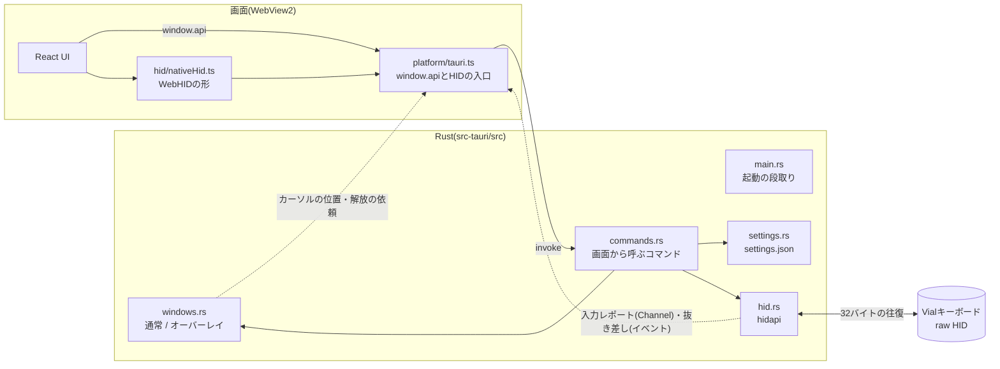
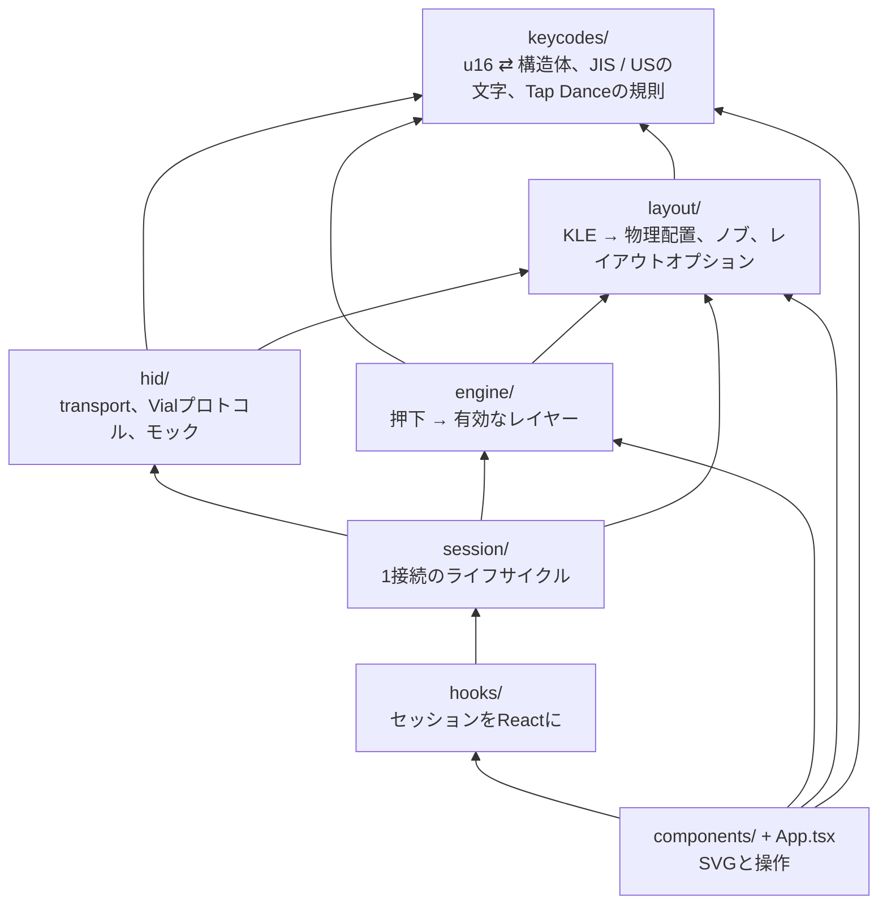
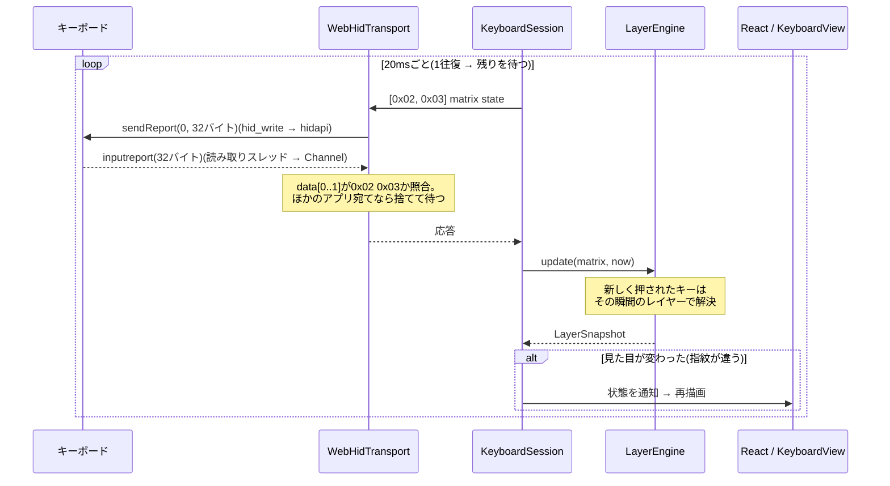
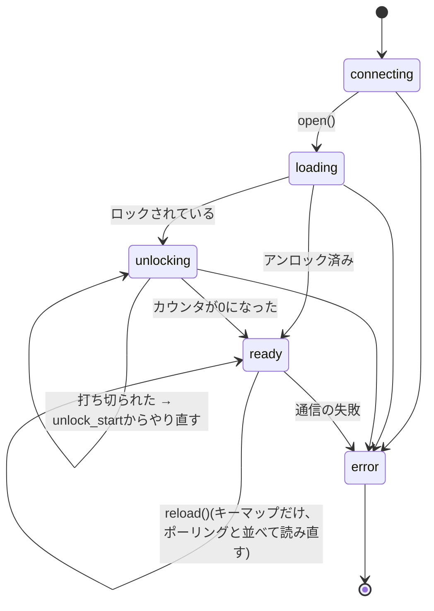

# 設計

Live Keymap Viewerの中身の地図。**何がどこにあり、なぜそうなっているか**を書く。
手順(ビルド・テスト・機能の足し方)は[DEVELOPMENT.md](DEVELOPMENT.md)、
Vialのバイト列の話は[PROTOCOL.md](PROTOCOL.md)にある。

---

## 1. 前提

- **キーボードごとのデータを持たない。** キーマップ・レイヤー数・物理配置・カスタムキーコードの名前は、
  すべて接続したキーボードから読む。アプリに埋め込んであるのは、キーコードの「値 → 名前」の表と、
  JIS / USの文字の表だけ。
- **対象はWindows。** 開発はWSL(Rustはコンテナ)で行うが、WSLからはUSBが見えないので実機では動かない
  ([DEVELOPMENT.md §3](DEVELOPMENT.md#3-wslで開発するときの注意))。
- **アプリはTauri 2。** ウィンドウ・HID・設定・ログはRust、画面はReactで、WindowsのWebView2が描く。
  配布物はexe 1つ(8MBほど)。
- **対応はVial protocol 6 / VIA protocol 9だけ。** Cornix LPで確認している。

## 2. プロセスの構成

**HIDはRustのhidapiで扱い、画面からはWebHIDと同じ形に見せる。** WebView2には、WebHIDの許可や
選択ダイアログを差し込む口が無い。[hid/nativeHid.ts](../src/renderer/src/hid/nativeHid.ts)が
`navigator.hid`と`HIDDevice`のうちアプリが使うところだけを作るので、接続の管理(`session/`)・
候補の確認(`deviceProbe.ts`)・往復(`WebHidTransport`)・プロトコル(`vial.ts`)は、ブラウザのWebHIDと
同じコードで動く。ブラウザで開いたとき(`npm run dev`)は本物のWebHIDを使う。

Rustがするのは、Vialのインターフェース(usage page `0xFF60`)の一覧・開く・書く・届いたレポートを
画面へ流す・抜き差しを知らせる、だけ。直列化・タイムアウト・応答の照合は画面の側(`transport.ts`)で行う。
hidapiは1つのハンドルで読むのと書くのを同時にはできないので、同じデバイスを2回開き、読む用(専用のスレッド)と
書く用に分けている。抜き差しの通知は無いので、2秒ごとに一覧を取り直して差を見る(使っていたデバイスが
抜けたことは、読み取りの失敗ですぐ分かる)。

画面とRustのやり取りの型は[src/shared/ipc.ts](../src/shared/ipc.ts)の`RendererApi`(部品が使う関数)と、
[src-tauri/src/commands.rs](../src-tauri/src/commands.rs)(Rustのコマンド)。2つをつなぐのは
[platform/tauri.ts](../src/renderer/src/platform/tauri.ts)だけで、部品はTauriを直接呼ばない。
画面が使わないものは公開しない。

## 3. 画面の層

矢印は依存する向き。**下の層は上の層を知らない。** `keycodes` / `layout` / `engine`は
DOMにもHIDにも触らない純粋なロジックで、そのぶん単体テストが厚い。

| ディレクトリ | 主なファイル | 役割 |
|---|---|---|
| `keycodes/` | `decode.ts` | 生のu16を`Keycode`(判別共用体)にする。範囲はPROTOCOL.md §5 |
| | `labels.ts` | `Keycode` → 画面の文字。**JISの表とUSの表**、Shift側の文字、日本語の補足 |
| | `tapDance.ts` | `TapDanceEntry`と「長押しで出るレイヤー」の規則(engineと描画が共用) |
| | `table.generated.ts` | vial-guiの`keycodes_v6.py`から生成した名前の表 |
| `layout/` | `kle.ts` | KLEのパース。vial-guiの`kle_serial.py`と同じ挙動 |
| | `geometry.ts` | KLE → 物理キー / エンコーダー / 外接矩形 |
| | `knobButtons.ts` / `encoderStrip.ts` | ノブの押し込みがどのキーか(分かっているキーボードだけ) / 押し込みが分からないノブを図の下に並べる配置とviewBox |
| | `layoutOptions.ts` | VIAのレイアウトオプション(ビット詰め)をほどく |
| `engine/` | `layerState.ts` | `LayerEngine`。押下の列から有効なレイヤーを出す(§4の「レイヤーの判定」) |
| | `symbolRoutes.ts` | 記号ごとの打ち方(どのレイヤーの、どのキーを、Shift付きか)を手数の少ない順に |
| | `layerSummary.ts` | キーマップから、各レイヤーへの行き方(`Space長押し`など)と、空かどうかを読む |
| `hid/` | `transport.ts` | `Transport`インターフェース、直列化のキュー、`WebHidTransport` |
| | `vial.ts` | プロトコルの各コマンドと`loadKeyboard` / `reloadKeymap` |
| | `mockTransport.ts` | ファームと同じバイト並びで答える偽のデバイス |
| | `nativeHid.ts` | デスクトップ版のHID。Rustのhidapiを`navigator.hid` / `HIDDevice`の形に見せる(§2) |
| | `xz.ts` | 定義JSONのXZ展開 |
| | `deviceProbe.ts` | 候補のインターフェースに問い合わせ、答えるものを選ぶ |
| | `definitionCache.ts` | 定義のキャッシュ(localStorage。UIDと定義のバイト数で引く) |
| | `keymapCache.ts` | キーマップのキャッシュ(localStorage。UIDで引く)。接続した直後の表示に使う |
| `session/` | `keyboardSession.ts` | 1接続ぶん: 読み込み → アンロック → ポーリング → 読み直し |
| | `keyboardConnection.ts` | 接続を持ち続ける: デバイスの選び方、セッションの差し替え、切れたら再接続 |
| `hooks/` | `useVialKeyboard.ts` | 接続の状態をReactに渡す |
| | `useSettings.ts` | 設定をReactに渡す。変えるのは`update(patch)`だけ |
| | `usePreview.ts` | 図のプレビュー(乗せる・固定・記号の案内)と戻す規則。規則は`previewReducer` / `resolvePreview`の純粋な関数 |
| | `useKeymapGuide.ts` | キーマップから読む案内(行き方・記号の打ち方・キーの名前) |
| | `useOverlayFade.ts` | オーバーレイを薄くするか(`overlayFaded`)と、後ろのぼかしのオン/オフ |
| | `useAppUpdate.ts` | アプリの更新の確認と適用 |
| `components/` | `KeyboardView.tsx` / `KeyCap.tsx` | SVGの描画。プレビュー・Shiftの強調・レイヤー名の色帯 |
| | `LayerStrip.tsx` / `PreviewNotice.tsx` | ツールバーのレイヤーの一覧(行き方はツールチップ。設定で番号の横にも出せる。空は畳む)。乗せる・クリックするとプレビュー、ダブルクリックで名前 / プレビュー中のラベル |
| | `KeyboardFrame.tsx` / `StatusViews.tsx` | 図の枠(レイヤー色の縁・プレビューの破線) / エラーの帯と未接続の画面 |
| | `SymbolFinder.tsx` | 記号の出し方の一覧。選ぶとAppがそのレイヤーをプレビューし、押すキーを光らせる |
| | `SettingsPanel.tsx` / `ModifierBadges.tsx` | 設定パネル(レイヤー名・オーバーレイ・長押しの判定・更新) / Ctrl・Shift・Alt・Winの印 |
| | `ui/` | 共通の部品(`Button` / `Popover` / `Menu` / `Slider` / アイコン)。ボタンはすべて`Button`を使う |
| | `Toolbar.tsx` / `OverlayControls.tsx` | 通常ウィンドウの操作 / オーバーレイの操作パネルとクリック透過の切り替え |
| | `LoadingPanel.tsx` / `UnlockPanel.tsx` | 読み込みの進み具合 / アンロックの案内 |
| (直下) | `messages.ts` | 画面に出す文言。部品や接続まわりの案内はここから引く(キーの表示名は`keycodes/labels.ts`) |
| `lib/` | `cn.ts` / `theme.ts` / `report.ts` | Tailwindのクラスの組み立て(clsx + tailwind-merge)、JSから使う色トークン、ログへの報告 |
| `mock/` | `cornix.generated.ts` | モックのデータ(.vilと実機の定義から生成) |
| `platform/` | `tauri.ts` | Tauriで動いているときに`window.api`とHIDを用意する。**いちばん先に読み込む**(`main.tsx`) |

## 4. キーを押してから画面が変わるまで

- **matrix stateはアンロックしないと読めない**(ファームがキーロガー対策で止めている)。
- 押下の指紋(表示するレイヤー + 押されているキー + 長押しの確定 + モディファイア)が前回と同じなら
  通知しない。20msごとに50キーのSVGを描き直さずに済む。

### レイヤーの判定

`LayerEngine`([engine/layerState.ts](../src/renderer/src/engine/layerState.ts))の規則。QMKの厳密な
再現ではなく、表示のための近似。

- キーコードは**押した瞬間**のレイヤーの状態で確定する(QMKと同じ)。キーごとに、押した時点で解決した
  キーコードを持っておく。レイヤーキーを先に離しても、押しっぱなしのキーのキーコードは変わらない。
- `MO(n)`は押しているあいだ、レイヤーnを有効にする。
- `LT(n, kc)`と、on_holdが`MO(n)`のTap Danceは、次のどちらかでレイヤーnを有効にする。
  - 押し続けた時間がtapping term(設定の「長押しまで」。Tap Danceはエントリごとの値)を超えた
  - 押しているあいだに別のキーが押された
- Permissive Hold / Chordal Hold / Flow Tapは再現しない。同じ20msのあいだに2つ押されたキーは、
  行の若い順に押したものとして扱う。
- `TG(n)` / `TO(n)` / `DF(n)` / `PDF(n)`は押した時点で反映する。
- 表示するレイヤーは、有効なもののうち一番上。キーが透過(KC_TRNS)なら、下の有効なレイヤーへたどる。
- モディファイアも追う(`LayerSnapshot.mods`)。単独のモディファイアキーは押しているあいだ、MTと、
  on_holdがモディファイアのTap Danceは長押しが確定してから(LTと同じ規則)。

## 5. セッションの状態

`KeyboardSession`は1接続につき1つ作り、切断や再接続で**捨てて作り直す**。
作り直すのは`KeyboardConnection`で、`'idle'`(セッションが無い)と`reconnecting`(切れて再接続しようと
している)が加わる。一度でもunlocking / readyまで進んだ実機のセッションがerrorになったら、
2秒ごとに許可済みのデバイスを探し直し、HIDの`connect`イベントが来たら待たずに試す。

## 6. 設計の判断と、その理由

| 判断 | 理由 |
|---|---|
| **リクエストは1本のキューで直列化する**(`RequestQueue`) | ファームは応答にリクエストIDを持たない。並行して送ると取り違える |
| **タイムアウトで諦めた要求の数を数え、遅れて届いた応答は捨てる**(`WebHidTransport.abandoned`) | ファームは応答に要求IDを持たないので、諦めた要求への応答が遅れて届くと、**送り直した要求の応答として受け取ってしまい、以後ずっと1回ずつずれる**(BLUETOOTH.md §3)。同じコマンドなので照合では弾けない。応答は送った順に返るので、諦めた数だけ捨てれば並びが戻る。応答ごと失われた場合に数え続けないよう、2秒の窓を過ぎたら数え直す |
| **タイムアウトは往復時間に合わせて延ばす**(`WebHidTransport.timeoutFor`) | Bluetoothの往復は450ms前後あり、USB向けのタイムアウト(matrixは200ms)より長い。固定のままだと、送り直しても毎回間に合わず読めない。届いた応答から往復時間を覚え、呼び出し側の値と「往復 × 3」(上限2秒)の長い方まで待つ。タイムアウトして捨てる応答からも往復を測り、待っている要求の期限をその場で延ばすので、最初の往復を別に測らなくてよい。答えないデバイスは往復が測れないので、待つ時間は延びない |
| **応答は照合してから受け取る**(`SendOptions.validate`) | raw HIDの入力レポートは、そのHIDを開いている**全プロセス**に配られる。Vialを開いたままだと、Vial宛ての応答も届く。VIAコマンドは`data[0]`にコマンドIDが残るので、それで見分ける(PROTOCOL.md §2) |
| **候補が複数あれば、答えるものを確認してから接続する**(`pickResponsiveDevice`) | USBとBluetoothの両方で接続していると、同じVID/PIDのVialインターフェースが2つ見え、出力先でない側は答えない。`[0xFE, 0x00]`はアンロック中でも必ず答えるので、それで確認し、一番速いものを使う |
| **接続したら、まずキャッシュで図を出し、裏で読み直して確認する** | 全部読むには70〜96往復かかる(USBで数秒、Bluetoothでは30秒)。そのあいだ画面には何も出ない。しかもモードを切り替えるたび、再接続するたびに起きる。キャッシュ(定義 + キーマップ)が揃っていれば、身元を確かめる**3往復**(VIAの版・Vialの版とUID・定義のバイト数)だけで図を出し、押下のポーリングもすぐ始める。読み直しは裏で走らせ、違っていたらエンジンごと差し替える。要求は1本のキューに並ぶので、確認しているあいだはmatrixの間隔が延びるだけで、押下の表示は止まらない |
| **モードを切り替えるときは、古いウィンドウにキーボードを解放させてから新しいウィンドウを作る** | 透明なウィンドウは作り直すしかなく、新しい画面はできた瞬間から同じキーボードに話しかける。古い方はまだ20msごとにmatrixを読んでいて、raw HIDの応答は開いている**全員**に配られる(ウィンドウごとにハンドルを開く)。`0xFE`系は照合できないので、両方が話していると新しい方の読み込みが壊れる。そこでRustが古いウィンドウにだけ`hid-release`を送り、返事(または600msのタイムアウト)を待ってから作る。解放する側は表示を残したまま降りる(`KeyboardConnection.release`) |
| **接続のライフサイクルはReactの外に置く**(`KeyboardSession`) | フックの中でsetIntervalとrefを組み合わせると、切断直後に遅れて届いた応答が新しい画面に書き込めてしまう。ループをawaitで回し、世代番号で止め、破棄した後は一切通知しない |
| **読み直しでは定義(物理配置)を読まない** | 定義はファームを書き換えないと変わらず、書き換えればUSBごと再接続になる。図を組み直さないので描画も跳ねない |
| **定義はキャッシュする**(UID + 圧縮した定義のバイト数) | 同じ理由で、接続するたびに読む必要が無い。モードを切り替えるたびにウィンドウごと作り直すので、キャッシュが無いと毎回読むことになる。読まずに済めば、照合できない`0xFE`系の要求も減る(BTでは取り違えると定義が壊れる)。書き換えてもバイト数が同じ、ということはあり得るので、手動の「キーマップを読み直す」はキャッシュを使わずに読み直す |
| **長押しの判定時間は、キーボードから読めたらそれを使う**(`getTappingTerm`) | アプリの設定とキーボードの設定がずれると、LTのレイヤーの表示だけ早く / 遅く切り替わる。QMK設定(RMKではbehavior setting)の`qsid 7`で読める。読めなければ(QMK設定の無いファーム、RMKで未設定)設定の値を使う。1往復しか増えない |
| **Tap Danceは使う枠と先頭5個だけ読む** | 枠は32個あり、1枠1往復。Cornixが使うのは1個で、全部読むと読み込みの1/4を占める。ノブにもTDを割り当てられるので、ノブまで読んでから決める。先頭の数個は、使っていなくても読んで余裕を持たせる |
| **読み直しでは、レイヤーの状態を捨てない** | 中身が同じならエンジンも画面もそのまま使い、変わっていればTGの固定・既定のレイヤー・押しているキーを新しいエンジンに引き継ぐ。キーボード側は覚えたままなので、捨てると表示だけがずれる |
| **設定のディスクへの書き込みはまとめる**(400ms、終了時にも書き出す) | 設定はスライダーからも来るので、つまみを1回動かすと十数回届く。そのたびにファイルを書くのは無駄が多い。値はその場でメモリに反映するので、読み書きの見え方は変わらない(`settings.rs`の`SettingsStore`)。同じ理由で、後ろのぼかし(OS側の切り替え)も同じ状態なら掛け直さない |
| **応答が返らない時間で切断を決める**(`STALL_LIMIT_MS` = 15秒)。**タイムアウト以外の失敗は待たずに切る** | 短く切ると、ウィンドウの移動・リサイズのドラッグ中や、OS・ファームの省電力で一瞬詰まったときに、切断 → キーマップの丸ごと読み直しになる(Windowsではドラッグ中にウィンドウのメッセージループが止まり、応答が画面に届くのが遅れることがある)。回数ではなく時間で数えるのは、往復が遅いほど1回の失敗に時間がかかるため(BTでは1回1.5秒以上)。長く待てるのは、ケーブルが抜けた・デバイスが消えたときは、タイムアウトではなく書き込みそのものがすぐ失敗するから(`TransportError`かどうかで見分ける。`nativeHid.ts`も、書けなければ`TransportError`でないErrorで返す)。待っているあいだは最後の表示のまま読み続け、ツールバーの丸だけで「応答待ち」と知らせる(オーバーレイにはツールバーが無いので、左上のパネルに出す) |
| **キーマップの読み直しが失敗しても、セッションは落とさない** | 1回タイムアウトしただけでセッションをerrorにすると、接続が切れて再接続で丸ごと読み直すことになる。タイムアウトなら前のキーマップのまま続ける(また手動で読み直せる) |
| **読み直しのあいだもポーリングを止めない** | 読み直しは69往復かかり、BT(1往復 約470ms)では30秒ほどになる。止めるとそのあいだ押下が出ず、切断したように見える。接続直後の裏の確認と同じく、要求は1本のキューに並べ、matrixの間隔が延びるだけにする。変わっていたときだけエンジンを作り直してポーリングを入れ替える |
| **切れたら再接続する。ただし読み込みの途中の失敗は繰り返さない** | 抜き差しやスリープからの復帰で止まったままだと、使うたびに「接続」を押すことになる。未対応のファームなど、読み込みで失敗するものは何度やっても同じなので、タイマーでは試さない |
| **隠れていてもタイマーを間引かせない**(WebView2に`--disable-background-timer-throttling`など) | Chromiumの既定では、最小化したときや完全に隠れたときにタイマーが1秒に1回になり、20msのポーリングが止まる。そのあいだのTG / DFを取りこぼす。Tauriの`background_throttling`はWindowsでは効かないので、WebView2にChromiumのスイッチを渡す(`windows.rs`の`BROWSER_ARGS`。全ウィンドウで同じにする。WebView2は同じデータフォルダを違うオプションで開けない) |
| **ロックを見つけたら自動でアンロックを始める** | 押下を読むには他に方法が無く、確認のボタンを置いても選択肢が1つしかない。オーバーレイはクリックが透過するので、ボタンは押せない |
| **ノブは押し込みキーを円く描き、回したときの割り当てを上下に挟む** | Cornixの定義はエンコーダーを図の右端に並べて置いてあり、KLEの座標には意味が無い。押し込みキー(Cornixなら消音・中クリック)は上下が空いているので、そこに挟めば場所も取らず、どのノブの割り当てかも図の上で分かる。ただ、押し込みがどのキーかはVialの定義に無いので、分かっているキーボードだけ`layout/knobButtons.ts`に持ち、ほかは図の下に同じ上下の形で並べる。上を右回りにするのは、音量なら「音量+」が上に来るように |
| **モードを変えるたびにウィンドウを作り直す** | 透明なウィンドウは、作った後から切り替えられない |
| **オーバーレイの操作パネルの上だけクリック透過を切る**。**透過中はRustがカーソルの位置を送る** | 画面は、ポインタが`data-interactive`の上に来たときだけ透過を解く(`OverlayControls`)。ところが透過中はウィンドウにmousemoveが届かない。そこで透過中はRustが33msごとにカーソルの位置を読んで`overlay-cursor`で送り、画面は同じ形のmousemoveとして流す(`platform/tauri.ts`)。透過を切っているあいだは本物のmousemoveが届くので送らない |
| **タスクトレイにアイコンを置く**(`tray.rs`) | オーバーレイはタスクバーに出さない(`skip_taskbar`)ので、オーバーレイで使っているあいだはアプリを見つける場所が無い。トレイから前に出す・切り替える・終了できるようにする。Tauri本体の`tray-icon`機能で足り、crateは増えない |
| **Windowsの起動時の自動起動は、OSへの登録で持つ**(`tauri-plugin-autostart`、`autostart_get` / `autostart_set`) | settings.jsonに持つと、OSの登録(HKCUのRun)と食い違ったときにどちらが正しいか分からない。登録そのものを読み書きする。名前は開発版とリリース版で分け(`channel::TITLE`)、両方入れても互いの登録を上書きしない。登録するのは動いているexeのパスで、インストーラーで入れたものは更新しても変わらない(`current`フォルダ) |
| **配布ビルドにCSPを付ける**(`tauri.conf.json`の`security.csp`) | 画面は自分のファイルとTauriとのやり取り(`ipc:` / `http://ipc.localhost`)しか使わないので、それ以外を読み込めないようにしておく。xzの展開(`xz-decompress`)はWebAssemblyを使うので`script-src`に`'wasm-unsafe-eval'`が要る(無いと定義を展開できず接続に失敗する)。Reactの`style`はCSSOMで書くので`style-src`に`'unsafe-inline'`は要らない。Tauriは自分のスクリプトの分をCSPに足す。開発中(`devCsp: null`)は、Viteが`<style>`を差し込んで差し替えるので掛けない |
| **Tauriを使う** | Windowsに入っているWebView2を使うので、Chromium一式を同梱せずに済み、配布物がexe 1つ(8MBほど)になる。exeのアイコンとバージョン情報もビルドで入る。**メモリはあまり減らない**(WebView2も中身はChromiumで、画面のプロセスはほぼ同じだけ使う)。画面・プロトコル・接続の管理はTypeScriptで書き、Rustはウィンドウ・HID・設定・ログだけを受け持つ |
| **Windows版はLinuxからクロスビルドする**(cargo-xwin) | 手元(WSL)とCI(Ubuntu)で同じ手順になり、wineもWindowsも要らない。cargo-xwinはMSVCのCRTとWindows SDKをダウンロードして、clang / lldでリンクする。hidapiはCを使わないWindows実装(`windows-native`)にして、Cのクロスコンパイルを避けた |
| **Rustの道具はコンテナ(podman)に入れる** | WSL(ホスト)を汚さず、CIと同じ道具をそろえられる。`scripts/container.mjs`がWSLで打ったコマンドを中で動かすので、`npm run deploy:win`は1回で済む。Windowsに置く部分だけはpowershell.exeが要るのでWSLで動かす |
| **インストーラーと更新はVelopack。CIはUbuntuで作る** | Velopackのセットアップはワンクリックで入れて起動し、アプリの中から「更新して再起動」で入れ替えられる。入る場所がパッケージID(`live-keymap-viewer`)から決まるので、パスに半角スペースが入らない(Tauri標準のNSISは製品名から決まり、スペースが入る)。vpkはLinuxからWindows向けのパッケージを作れるので、wineもWindowsも要らず、手元とCIが同じ手順になる。代わりにビルド用のコンテナに.NETが入る(配布物には入らない)。Velopackのポータブル版は起動用exeに表示名(スペース入り)が付くので作らない |
| **更新は、このリポジトリのGitHubのリリースから取る**(`releases/latest/download`) | 公開リポジトリなので認証が要らない(トークンをexeに埋め込むと、中身を読まれたときに漏れる)。最新の正式リリースだけを見るので、プレリリースは更新の対象にならない。モードを切り替えるたびにウィンドウごと作り直すので、確認の結果はRustが1時間使い回す(認証なしの問い合わせは1時間に60回まで) |
| **開発版は別のアプリとして入れ、dev-buildから更新する**(`channel.rs`) | mainへのpushのたびに試せるようにしつつ、リリース版を置き換えないため。パッケージID・表示名・設定の置き場所・WebView2のデータ・更新の元を分けるので、1台に並べて入れても設定を書き合わない。どちらになるかはビルドのときに決める(実行時に切り替えると、同じexeがどちらの設定を読むか分からなくなる)。版は`次のパッチ版-dev.実行番号`にして、ビルドのたびに増やす |
| **Shiftを押しているあいだは、Shiftで入る文字を主文字にする** | エンジンがモディファイアも追う(`LayerSnapshot.mods`)。単独のShiftは押しているあいだ、MT / Tap DanceのShiftは長押しが確定してから(LTと同じ規則)。時間だけで確定したときも画面が変わるよう、通知の指紋にmodsを入れている |
| **プレビューは、キーを押したら実際の表示に戻す** | 打ち始めたのに違うレイヤーが出たままだと、押したキーと図が食い違う。縁を破線にして、実際の状態ではないと示す |
| **レイヤー名はsettings.jsonに、キーボードのUIDごとに持つ** | Vialにはレイヤー名が無い。ほかの設定と同じく手で直せる場所に置き、読むときも画面から受け取るときも、UID・番号・長さを確かめる。キーの色帯には「L2記号」→「記号」→「L2」の順に、幅に入るものを出す |
| **オーバーレイの後ろのぼかしはOSに描かせる(Windows 11のアクリル)** | CSSのbackdrop-filterでは、透明なウィンドウの後ろ(ほかのアプリ)はぼかせない。WebViewがぼかせるのは自分の中身だけ。代わりに強さは選べず、オン/オフだけになる(Tauriの`set_effects`)。薄くしているあいだは外す(薄くするのは後ろを読むためなので)。いつ薄くするかは画面が決めているので、画面からRustに伝える。ウィンドウの配色は暗い側に固定する(OSがライトテーマだと、ぼかしの色味もライトになるため) |
| **オーバーレイはベースレイヤーのあいだ薄くする** | 常に最前面なので、ふだんの入力のあいだも画面を覆ってしまう。濃く戻すのはすぐ、薄くするのは300ms待ってから(レイヤーキーを短く押したときにちらつかせない) |
| **色味(色相)はレイヤーだけに使う** | 記号キーや主ボタンにレイヤーの色(たとえばL2のティール)を使うと、L2に入ったときに背景の色とまぎれ、「L2に入った」表示とも見分けが付かなくなる。押下は黄、Shiftで変わるキーは白い実線、アンロックは回る白い破線、ボタンは明るさの差で見せる(`components/ui/Button.tsx`) |
| **ツールバーは常に1行。レイヤーの一覧もその中に置く** | 折り返すと、図に使える高さが減る。幅が足りなければ、状態の文字・レイヤー名・行き方の順に隠し、それでも入らなければ一覧を横に流す |
| **プレビューは、乗せているあいだと、クリックして固定の2通り** | 覗くだけなら、乗せて外すのが一番手数が少ない。固定したものは、キーを押すかEscで戻す。チップはクリックでフォーカスを取らない(取ったままだと、実機のSpace / Enterでブラウザがそのボタンを押し、戻したプレビューがまた固定される) |
| **キーマップの読み直しは手動だけ**(フォーカスが戻っても読まない) | 接続したときに読んでいる(キャッシュなら裏で確認している)ので、ウィンドウに戻るたびに読む必要は無い。BTでは1回30秒以上かかり、そのあいだ「読み直し中…」が出続けてしまう。Vialで編集したら「キーマップを読み直す」を選ぶ |
| **読み直し・切断はデバイス名のメニューにしまう** | 使う頻度が低く、切断は押し間違えると困る。よく使うJIS/US・オーバーレイと同じ重さで並べない |
| **lintとフォーマットはBiome、コミット時の検査はhusky** | どちらも依存が小さく、設定が1か所で済む(ESLint + Prettierは6パッケージ・設定2ファイルになる)。huskyは、見れば誰でも分かる標準的な置き場所 |
| **画面からの設定の変更は1つのコマンドで受ける**(`settings_update`) | 項目ごとにコマンドを作ると、設定を1つ足すたびに何か所も触ることになる。変えてよい項目を`RENDERER_SETTINGS_KEYS`に決め打ちし(TSとRustの両方)、Rustはそれ以外を捨ててから`sanitize`で検証する(壊れた値は、手で直したファイルと同じく既定値に戻る)。ウィンドウの位置・モード・許可したデバイスは画面から書かせない |
| **Appは部品をつなぐだけにし、状態と規則はフックに置く** | Appに状態を集めると、設定・プレビュー・案内の状態が混ざって追えなくなる。プレビューの規則(キーを押したら戻る、Esc、乗せている方が勝つ …)は一番こみ入っているのでreducerにして、画面なしでテストする(`tests/preview.test.ts`) |
| **設定は項目ごとに検証して読む**(`settings.rs`の`sanitize`)。**置き場所は`%APPDATA%\live-keymap-viewer`** | 手で直したファイルや古い版のファイルが残っていても起動できるように。外したモニターの上に復元されたウィンドウは主画面に戻す。フォルダ名にはスペースを入れない(コマンドラインやスクリプトで扱うときに引用符が要らないように) |

## 7. 壊しやすいところ

変更するときにはまりやすい落とし穴。

- **VIAとVialで応答の位置が違う。** VIAコマンドの戻り値は`data[1]`以降、Vialコマンド
  (`0xFE`)は`data[0]`から(PROTOCOL.md §1)。
- **アンロックの進行中はVIAコマンドが通らない。** そのあいだにkeymapやmatrixを読みに行くと、
  ファームは書き換えずにリクエストをそのまま返す。
- **キーコードは押した瞬間のレイヤーで確定する。** レイヤーキーを先に離しても、押しっぱなしの
  キーのキーコードは変わらない(QMKと同じ)。`LayerEngine.update`は「離す → 押す」の順に処理する。
- **CSSは「基本 → 種類 → 状態」の順に並べる。** 種類(`.key-sym`)と状態(`.key-pressed`)は
  詳細度が同じなので、後に書いた方が勝つ。逆にすると、押下中の記号キーの文字色が壊れる。
- **Tauriのウィンドウ操作を、ロックを持ったまま呼ばない**(`windows.rs`)。メインスレッド以外から
  呼ぶとメインスレッドに頼んで返事を待つので、メインスレッドで同じロックを待つ処理と互いに待ち合って止まる。
- **表示する前のウィンドウにクリック透過を掛けない。** Linuxのtaoはpanicする(メインスレッドのpanicは
  巻き戻せず、アプリごと終わる)。表示した直後に掛ける。
- **このウィンドウ宛てのイベントは`getCurrentWebviewWindow().listen`で受ける。** 全ウィンドウ宛ての
  `listen`で受けると、モード切り替え中の古いウィンドウへの解放の依頼を、新しいウィンドウも受けてしまう。
- **ウィンドウを作るコマンドはasyncにする。** asyncでないコマンドはメインスレッドで動き、そこで
  ウィンドウを作るとWindowsでは止まる(`window_toggle_mode`)。
- **検証の範囲はTSとRustの2か所にある**(`shared/settings.ts`と`settings.rs`)。範囲や既定値を
  変えるときは両方を直す。
- **パッケージID(`live-keymap-viewer`、`scripts/pack-win.mjs`)を変えない。** 変えると別のアプリとして
  扱われ、入っているものが更新されなくなる。
- **vpkとアプリの`velopack` crateは同じ版にする**(Dockerfileの`VPK_VERSION`とCargo.toml)。
- **`VelopackApp::build().run()`は`main`のいちばん先に置く。** インストール・更新の途中でVelopackがexeを
  呼んだときは、そこで用を済ませて終わる。後ろに置くとウィンドウが出てしまう。
- **同じキーボードが2つ見えることがある。** USBとBTの両方で接続しているとき。
  `getDevices()`の先頭を選ぶと、答えない側を選んで全リクエストがタイムアウトする。
  デバイスを選ぶところでは必ず`pickResponsiveDevice`を通す。
- **確認するあいだは候補を開いたり閉じたりする。** いまのセッションが使っているデバイスを閉じると壊れるので、
  先にセッションを破棄してから確認する(`KeyboardConnection`の`connectToResponsive`)。
- **`snapshot.tapDance`は穴あき。** 読んでいない枠は`undefined`(`tapDanceToRead`)。
  Tap Danceを引くところでは、枠が無い場合を必ず扱う。
- **TG / DFの状態はアプリの推測。** キーボードから読む手段が無いので、押下から追っている。
  アプリを起動する前や、切れていたあいだに押したものは分からない。
- **押しているキーは`held.keycode`(押した瞬間の値)で描く。** 表示中のレイヤーで引き直すと、
  そのレイヤーでは別のキーになっている位置(TDでL4に入ったときのTDの位置など)で、
  長押しのレイヤーが分からなくなる(「Lnull長押し中」と出てしまう)。
- **オーバーレイで押させたいものには`data-interactive`を付ける。** クリックは透過していて、
  付いている要素の上でだけ透過を切る(`OverlayControls`。透過中のカーソルの位置はRustが送ってくる)。
  付け忘れると、見えているのに押せないボタンになる。
- **オーバーレイを薄くするopacityは、`main`(`.overlay-body`)1つにだけ掛ける。** 背景の板は
  その`::before`にある。板と図に別々に掛けると、薄くなる途中で濃さがずれ、キーと背景がばらばらに透ける。
- **SVGの`font-size`属性はCSSに負ける。** `.sub`や`.shift`のように、CSSで大きさを決めている
  クラスを個別に変えるときは`style`で渡す。
